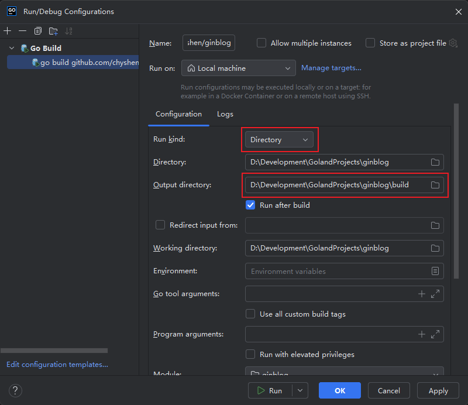

##  1. `github`中新建仓库


1. 点击`Create new...`按钮，选择`New repository`


2. 配置仓库，点击`Create repository`


3. 完成


## 2. 克隆仓库

```shell
git clone https://github.com/chyshen/ginblog.git
```


## 3. 初始化项目


```shell
# 进入项目目录
cd ginblog
# 初始化mod文件
go mod init github.com/chyshen/ginblog
# 创建main.go文件
touch main.go
```


## 4. `Goland`中打开项目


1. 打开项目


2. 创建相关目录和文件


```powershell
.
│  .gitignore			# git忽略文件
│  go.mod				# 项目依赖
│  LICENSE				# 开源许可证
│  main.go				# 程序入口文件
│  README.md			# 说明文件
│
├─.idea
│      .gitignore
│      ginblog.iml
│      modules.xml
│      vcs.xml
│      workspace.xml
│
├─api					# 接口
│  └─v1					# 接口版本控制目录
├─build					# 项目构建目录
├─config				# 配置文件
├─database				# 数据库备份文件
├─doc					# 开发文档
├─docs					# 接口文档
├─logs					# 日志
├─middlewares			# 中间件
├─models				# 数据模型层
├─routers				# 路由
├─tests					# 测试文件存放目录
├─uploads				# 上传文件存放目录
├─utils					# 项目公共工具库
└─web					# 前端
    ├─admin				# 管理页面存放目录
    └─front				# 前端展示页面存放目录
```


3. 配置运行


`Run kind`选择`Directory`，`Output directory`输出目录选择`build`目录




## 5. 测试


### 5.1 Gin

1. 安装

```shell
go get -u github.com/gin-gonic/gin
```

2. 创建`api/tests/test.go`测试接口文件

```go
package tests

import "github.com/gin-gonic/gin"

func Test(c *gin.Context) {
	c.String(200, "Hello World")
}
```

3. 创建路由文件`routers/router.go`

```go
package routers

import (
	"github.com/chyshen/ginblog/api/tests"
	"github.com/gin-gonic/gin"
)

func NewRouter() *gin.Engine {
	r := gin.New()

	r.GET("/test", tests.Test)

	return r
}
```

4. `main.go`程序入口文件中添加如下代码

```go
package main

import "github.com/chyshen/ginblog/routers"

func main() {
	router := routers.NewRouter()
	err := router.Run()
	if err != nil {
		panic(err)
	}
}
```

5. 运行

```shell
go run main.go
```

6. 浏览器中访问`http:127.0.0.1:8080/test`


