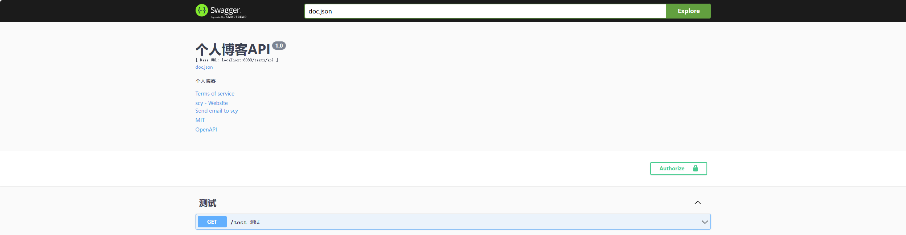
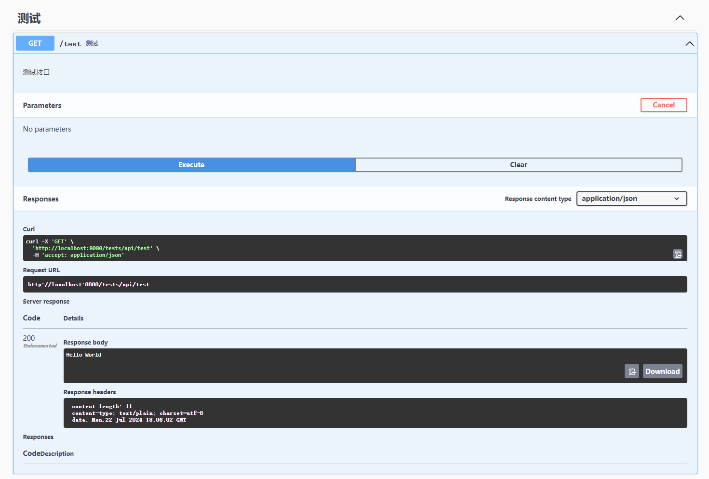

## 1. 简介

`Swag`将Go的注释转换为`Swagger2.0`文档

`Swag`项目仓库：https://github.com/swaggo/swag/


## 2. 安装

```shell
# 直接安装编译好的swag，在生成文档时，可能会报LeftDelim: “{{“,RightDelim: “}}“问题
go install github.com/swaggo/swag/cmd/swag@latest
# 可使用如下命令升级swag到最新版解决
go get -u github.com/swaggo/swag 
```


## 3. 添加注释

> `API`源代码中添加注释，添加在函数或方式上


## 4. 添加docs文件夹

> 在项目根目录下创建`docs`文件夹


## 5. 运行

> 在包含`main.go`文件的项目根目录下运行`swag init`

```shell
# swag注释只要有改变，都需执行如下命令重新生成文档
swag init
```

> 如果通用`API`注释没有写在`main.go`中（如写在router.go），可使用`-g`标识符指定

```shell
swag init -g routers/router.go
```


## 6. 使用`fmt`格式化`swag`注释

```shell
swag fmt
```


## 7. Swag与Gin集成


### 7.1 `router.go`中配置

```go
package routers

import (
	"github.com/chyshen/ginblog/tests/api"
	"github.com/gin-gonic/gin"

	_ "github.com/chyshen/ginblog/docs"	// docs 接口文档存放目录
	swaggerFiles "github.com/swaggo/files"	// swagger embed files
	ginSwagger "github.com/swaggo/gin-swagger" // gin-swagger middleware
)

func NewRouter() *gin.Engine {
	r := gin.New()

	test := r.Group("/tests/api")
	test.GET("/test", api.Test)
	
    // 使用gin-Swagger中间件为API文档提供服务
	r.GET("/swagger/*any", ginSwagger.WrapHandler(swaggerFiles.Handler))
	return r
}
```


### 7.2 `main.go`注释

```go
package main

import "github.com/chyshen/ginblog/routers"

// @title           个人博客API
// @version         1.0
// @description     个人博客
// @termsOfService  http://swagger.io/terms/

// @contact.name   scy
// @contact.url    http://github.com/chyshen
// @contact.email  mr.scy@outlook.com

// @license.name  MIT
// @license.url   https://opensource.org/licenses/MIT

// @host      localhost:8080
// @BasePath  /tests/api

// @securityDefinitions.basic  BasicAuth

// @externalDocs.description  OpenAPI
// @externalDocs.url          https://swagger.io/resources/open-api/
func main() {
	router := routers.NewRouter()
	err := router.Run()
	if err != nil {
		panic(err)
	}
}

```


### 7.3 `test.go`测试API注释

```go
package api

import "github.com/gin-gonic/gin"

// Test godoc
// @Summary      测试
// @Description  测试接口
// @Tags         测试
// @Router       /test [get]
func Test(c *gin.Context) {
	c.String(200, "Hello World")
}

```


### 7.4 生成`API`文档

```shell
swag init
```


### 7.5 运行程序

> 在浏览器中访问 http://localhost:8080/swagger/index.html




## 7.6 测试接口




