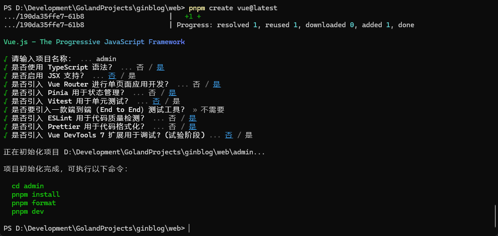
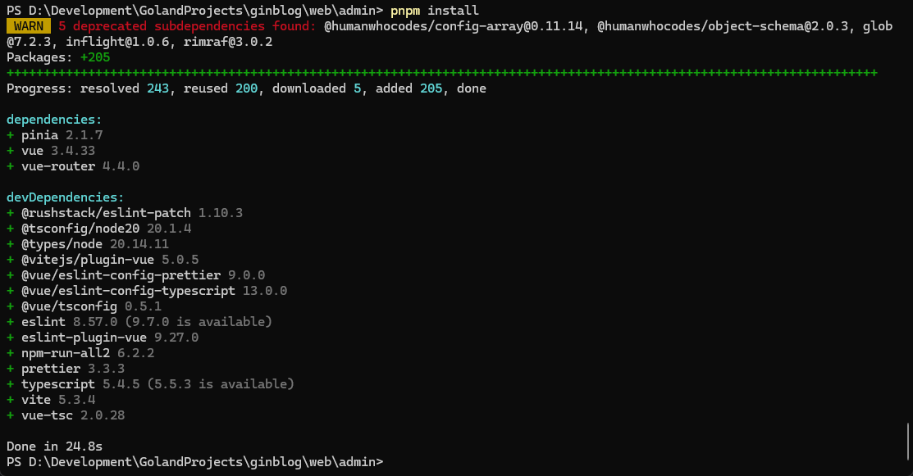

## 1. 后台管理系统初始化


### 1.1 创建一个`Vue`应用，名称为`admin`

```shell
pnpm create vue@latest
cd admin
pnpm install
pnpm run dev
```







### 1.2 引入`Element Plus`


#### 1.2.1 安装

```shell
pnpm install element-plus
```


#### 1.2.2 按需导入

```shell
# 配置自动导入插件
pnpm install -D unplugin-vue-components unplugin-auto-import
```


#### 1.2.3 Vite配置

```typescript
// vite.config.ts
import { defineConfig } from 'vite'
import AutoImport from 'unplugin-auto-import/vite'
import Components from 'unplugin-vue-components/vite'
import { ElementPlusResolver } from 'unplugin-vue-components/resolvers'

export default defineConfig({
  // ...
  plugins: [
    // ...
    AutoImport({
      resolvers: [ElementPlusResolver()],
    }),
    Components({
      resolvers: [ElementPlusResolver()],
    }),
  ],
})
```


#### 1.2.4 Sass

```shell
pnpm install -D sass
```


#### 1.2.5 国际化

```typescript
// 全局配置
import ElementPlus from 'element-plus'
import zhCn from 'element-plus/es/locale/lang/zh-cn'

app.use(ElementPlus, {
  locale: zhCn,
})
```


#### 1.2.6 日期和时间本地化

1. 方式一

> `Element Plus`默认支持[Day.js](https://day.js.org/docs/en/i18n/i18n)进行日期时间处理，直接导入使用即可

2. 方式二

> 使用 [Moment.js](https://momentjs.cn/)


#### 1.2.7 Icon图标

1. Element Plus提供的一套常用图标集合

   ```shell
   pnpm install @element-plus/icons-vue
   ```

2. [Iconfont]([iconfont-阿里巴巴矢量图标库](https://www.iconfont.cn/))图标


